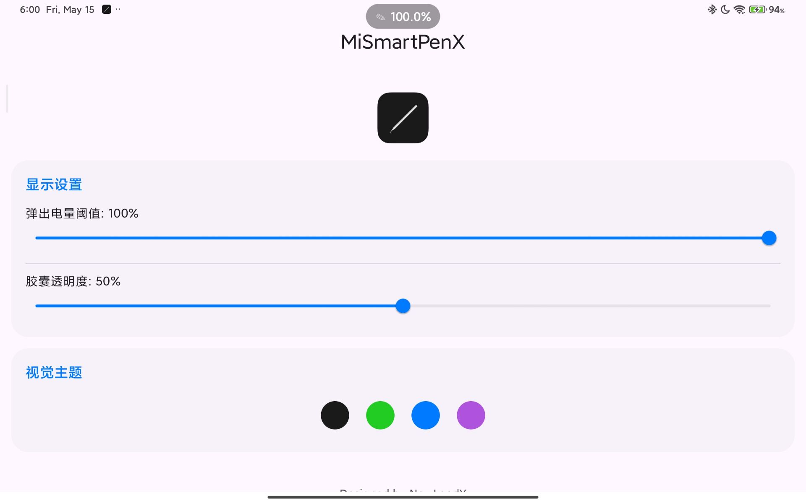
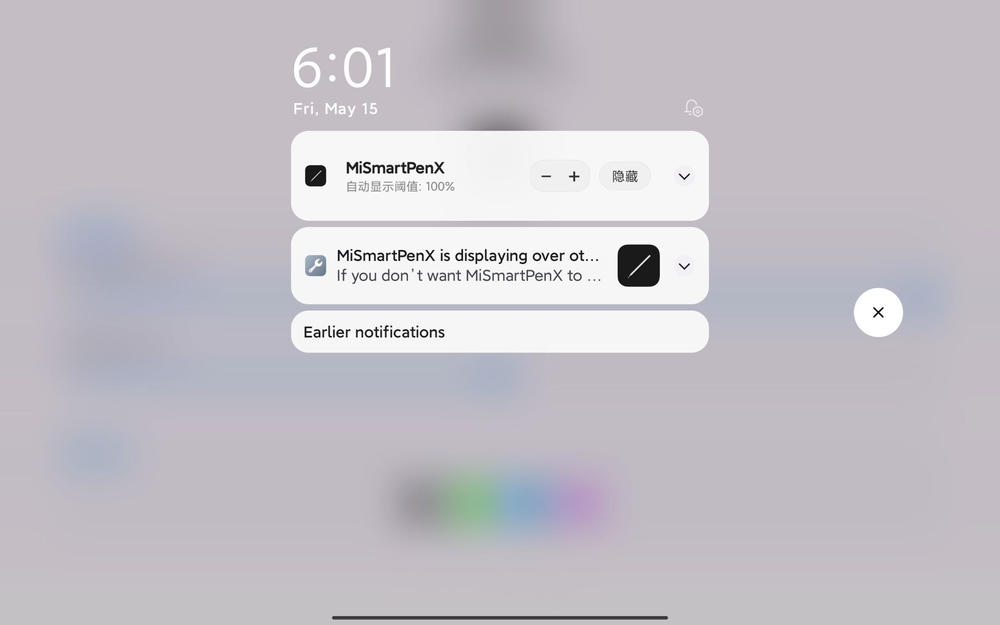

# MiSmartPenX

一个简约、精美的安卓组件，专为小米平板设计，用于在屏幕顶部实时显示小米触控笔的电量。

## 功能特点

- **自动感应**：当触控笔连接时自动弹出电量胶囊，断开时自动消失。
- **蓝牙电量刷新**：每 1 分钟读取一次小米触控笔蓝牙电量，减少只有贴到平板侧边时才刷新电量的问题。
- **智能电量确认**：融合蓝牙电量和 MIUI 贴合准确电量；贴合值作为校准，蓝牙明显更低时使用蓝牙值。
- **可拖动胶囊**：支持用手指拖动胶囊位置，避开系统通知栏和控制中心触发区。
- **快捷胶囊菜单**：手指轻触胶囊可展开简约菜单，快速隐藏/显示悬浮窗并调整自动显示阈值。
- **笔尖可视化窗口**：用触控笔从胶囊任意方向拖动，可展开圆形悬浮窗口，实时展示压感和倾斜方向。
- **平滑返回动画**：笔离开悬浮高度后，圆形窗口会平滑回到胶囊位置并恢复电量显示。
- **精美设计**：采用简约胶囊式视觉风格，支持充电状态显示。
- **快捷控制**：支持通过下拉通知栏快速开启或关闭悬浮窗、调整阈值。

## 安装说明

1. 下载并安装最新的 APK 文件。
2. 打开应用，根据提示授予以下权限：
   - **显示在其他应用上层**（悬浮窗权限）：用于在屏幕顶部显示电量胶囊。
   - **通知权限**：用于保持后台监控服务运行。
   - **附近设备/蓝牙权限**：用于读取小米触控笔蓝牙电量。
3. 权限授予后，应用将自动开始工作。

## 使用说明

- 用手指拖动电量胶囊可调整悬浮位置。
- 用手指轻触电量胶囊可打开快捷菜单。
- 用触控笔在胶囊上按下并向任意方向拖动，可进入压感/倾角圆形可视化窗口。
- 笔离开屏幕悬浮高度后，圆形窗口会自动返回胶囊状态。

## V0.2 更新

- 新增触控笔蓝牙电量轮询。
- 新增蓝牙电量和 MIUI 贴合电量融合策略。
- 新增手指拖动胶囊位置。
- 新增手指轻触胶囊快捷菜单。
- 新增触控笔压感、倾斜角圆形悬浮可视化。
- 新增圆形窗口返回胶囊的过渡动画。

## 常见问题

- **为什么电量不更新？**
  请确保已授予蓝牙权限，并在平板设置中允许该应用“自启动”，将“省电策略”设为“无限制”。
- **为什么贴合电量和蓝牙电量不一致？**
  贴合电量更像一次准确校准，蓝牙电量更适合持续刷新。应用会自动选择更合理的显示值。
- **为什么圆形窗口只在笔触发时出现？**
  应用会区分手指和触控笔，手指用于拖动位置和打开菜单，触控笔用于压感/倾角可视化。
- **如何关闭？**
  轻触胶囊后点击“隐藏”，或下拉通知栏点击“隐藏悬浮窗”，也可以直接停止该应用。

## 开源协议

MIT License
